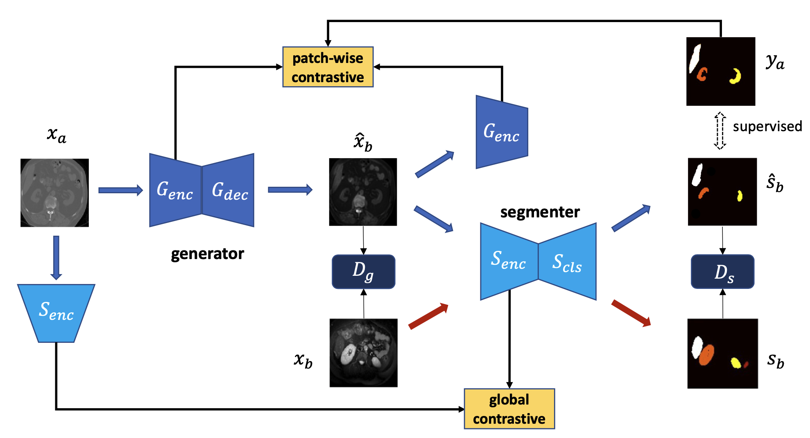

# CISFA
This is the official Pytorch implementation of paper "Contrastive Image Synthesis and Self-supervised Feature Adaptation for Cross-Modality 
Biomedical Image Segmentation"[arXiv:2207.13240](https://arxiv.org/pdf/2207.13240.pdf)

## Requirements
```
python=3.7.9
torch>=1.8.1
torchvision>=0.9.1
```
## Dataset
We use three datasets for two unsupervised domain adaptation task:
1. Abdominal dataset: 30 CT ([Multi-Atlas Labeling Beyond the Cranial Vault
Challenge](https://www.synapse.org/#!Synapse:syn3193805/wiki/89480)) and 20 MRI ([ISBI 2019
CHAOS CHALLENGE](https://chaos.grand-challenge.org/Download/));
2. Whole heart dataset: 20 CT and 20 MRI images ([MMWHS](https://zmiclab.github.io/zxh/0/mmwhs/))

### Preprocessing
We firstly crop every slice to only contain the region of interest, and this process is only based on pixel value 
without using label information. We then reshape the cropped slices to unified shape by interpolation. 196x196 for 
abdominal dataset, 160x160 for MMWHS data. We store every volume as a npy file [2, X, H, W], X is the number of slices, 
and HxW is the size. The first channel is the data, and the second channel is the label. We then divide each dataset into 
four folds for cross-validation. The splits information can be found in /data, for example data/abdominal_data/chaos/splits.pkl.

We also provide with the data after preprocessing (coming soon), and just put the data as the following structure:

    .
    ├── ...
    ├── data                    
    │   ├── abdominal_data              
    │       ├── chaos           # MRI images
    │           ├── splits.pkl
    │           ├── croped
    │               ├── mr_img_1.npy
    │               ├── mr_img_2.npy
    │               ├── ...
    │       ├── multi_atlas    # CT images
    │           ├── splits.pkl
    │           ├── croped
    │   ├── mmwhs            
    │       ├── mri            # MRI images
    │           ├── splits.pkl
    │           ├── croped
    │               ├── mr_train_1001_image.npy
    │               ├── mr_train_1002_image.npy
    │               ├── ...
    │       ├── ct             # CT images
    │           ├── splits.pkl
    │           ├── croped
    └── ...

## Training
```
bash cut_abd_job.sh
```
or 
```
python CUTExperiment.py --model ${model} --batch_size ${batch_size} --n_epochs 200 --seg_start_point 0 \
--n_epochs_decay 0 \
--fold ${fold} \
--num_classes ${num_classes} \
--pcl_idt False \
--lambda_PCL ${l_pcl} \
--src_dir ${where_you_store_the_source_data}  --src_data_dir ${the_direct_you_store_the_processed_source_data} \
--target_dir ${where_you_store_the_target_data} --target_data_dir ${where_you_store_the_processed_target_data} \
--name ${exp}_f${fold}_b${batch_size}
```
eval.sh give examples of src_dir and src_data_dir, we set the two parameters because there might be different 
preprocessing settings, and we store them in different folders under src_dir 

### meaning of different model
You can change the $model parameter in cut_abd_job.sh for different settings


1. cut_atten_coseg_sum_model: final method;

2. cut_coseg_sum_model: w/o weight on the pcl (ncl);

3. cut_coseg_sequential_model: for gcl, update the encoder first and then the whole segmenter;


### Evaluation
To evaluate the trained models on test data,
```angular2html
bash eval_job.sh
```

## Credit
This repo is mainly based on [Basic U-Net example by MIC@DKFZ](https://github.com/MIC-DKFZ/basic_unet_example) and 
[contrastive-unpaired-translation](https://github.com/taesungp/contrastive-unpaired-translation).

## CITE
If you find this repo useful, please cite the paper.
```
@article{hu2022contrastive,
  title={Contrastive Image Synthesis and Self-supervised Feature Adaptation for Cross-Modality Biomedical Image Segmentation},
  author={Hu, Xinrong and Wang, Corey and Shi, Yiyu},
  journal={arXiv preprint arXiv:2207.13240},
  year={2022}
}
```
